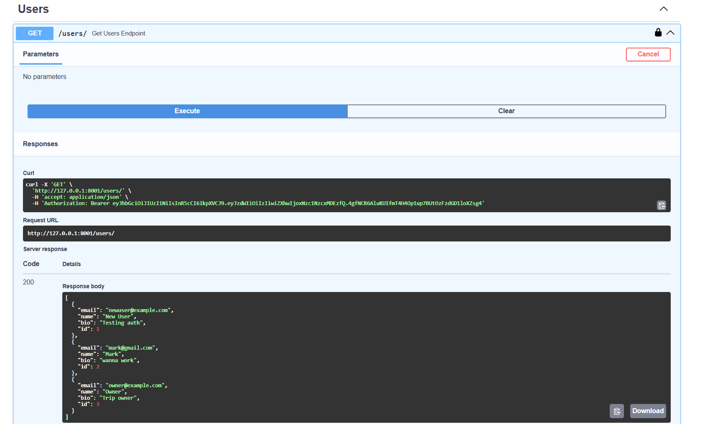
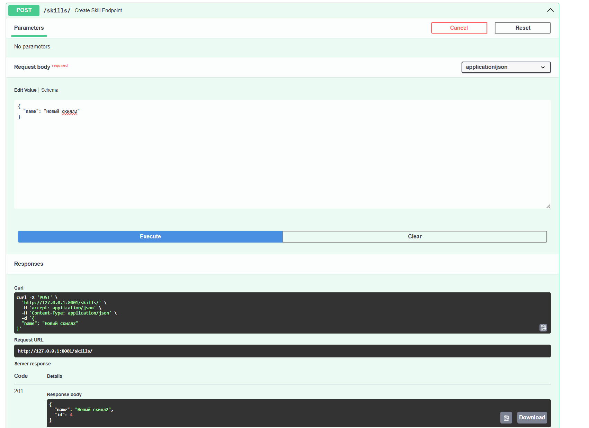

# API

## Создание пользователя

POST /users/

Пример запроса:

    {
      "email": "user@example.com",
      "name": "Alex",
      "bio": "Traveler",
      "password": "12345678"
    }

Пример ответа:

    {
      "id": 1,
      "email": "user@example.com",
      "name": "Alex"
    }

## Демонстрация работы GET запроса

## Создание поездки

POST /trips/

    {
      "title": "Trip to Georgia",
      "description": "Looking for people"
    }

## Демонстрация работы POST запроса

## Поиск

GET /trips/search?country=Georgia

## Эндпоинты

### Users
- POST /users/
- GET /users/
- GET /users/{id}
- PUT /users/{id}
- DELETE /users/{id}

### Trips
- POST /trips/
- GET /trips/
- GET /trips/{id}
- PUT /trips/{id}
- DELETE /trips/{id}

### Destinations
- POST /destinations/trip/{trip_id}
- GET /destinations/

### Participants
- POST /trip-participants/trip/{trip_id}