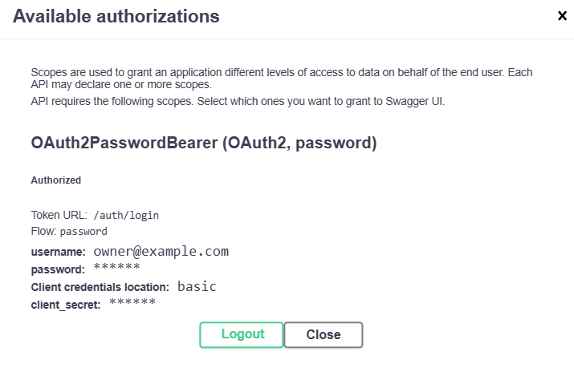
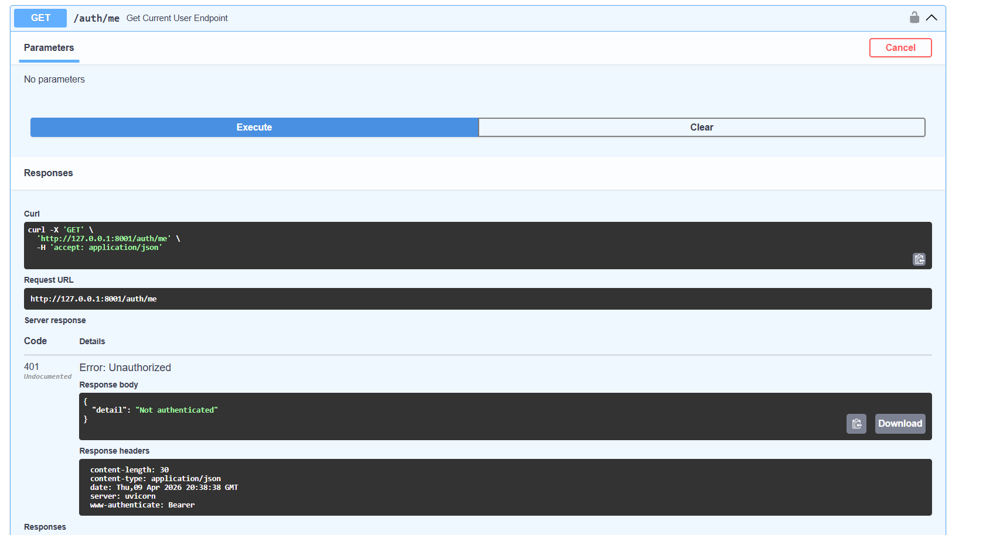

# Авторизация

Используется JWT.

## Логика

1. пользователь вводит email и пароль  
2. сервер проверяет данные  
3. возвращает токен  
4. токен используется в заголовке Authorization  

## Код логина

    @router.post("/login")
    def login_endpoint(form_data: OAuth2PasswordRequestForm = Depends()):
        user = get_user_by_email(db, form_data.username)

        if not verify_password(form_data.password, user.hashed_password):
            raise HTTPException(status_code=401)

        token = create_access_token({"sub": str(user.id)})
        return {"access_token": token}

## Использование токена

Authorization заголовок:

    Authorization: Bearer <token>

## Получение текущего пользователя

    def get_current_user(token: str = Depends(oauth2_scheme)):
        payload = decode_access_token(token)

## Пример авторизации

## Если пользователь не авторизован - получаем ошибку

