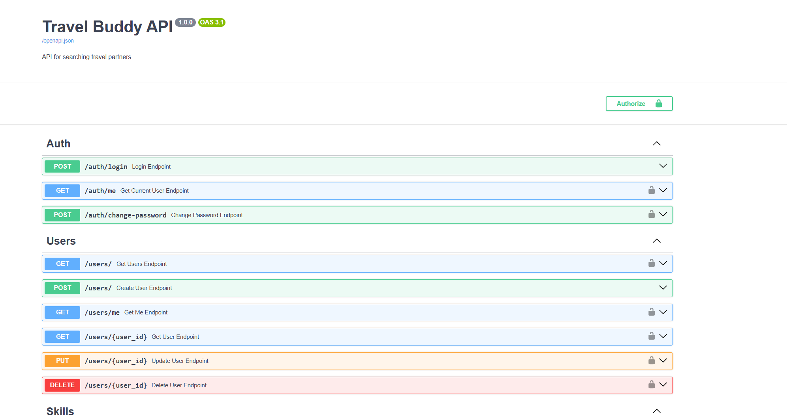

# Travel Buddy API

Веб-сервис для поиска попутчиков и организации поездок.

Проект реализован с использованием FastAPI, PostgreSQL и SQLAlchemy.

Основные возможности:
- регистрация и авторизация пользователей
- создание поездок
- добавление маршрутов
- управление участниками поездок
- поиск поездок

## Главная страница API
