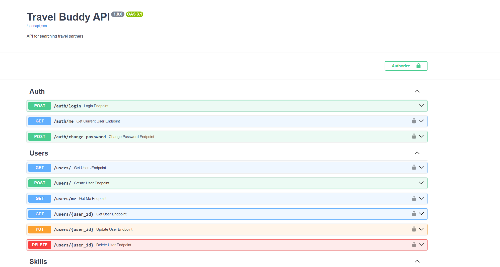
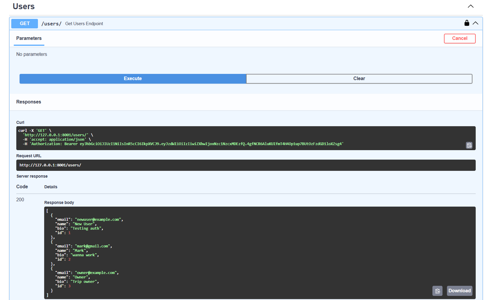
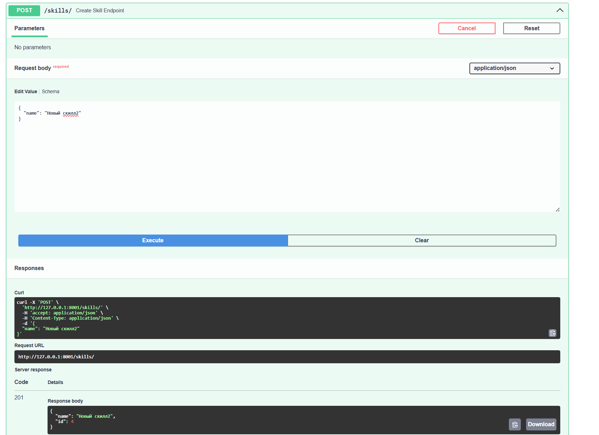
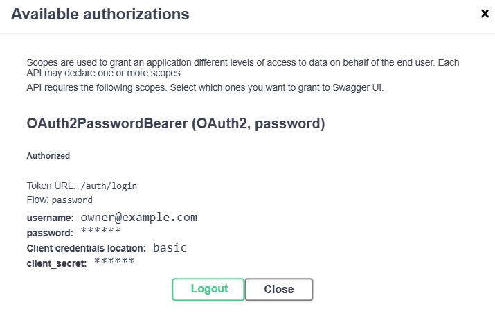
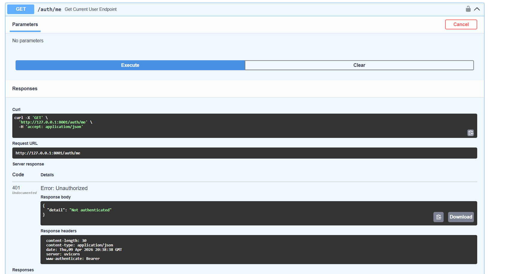
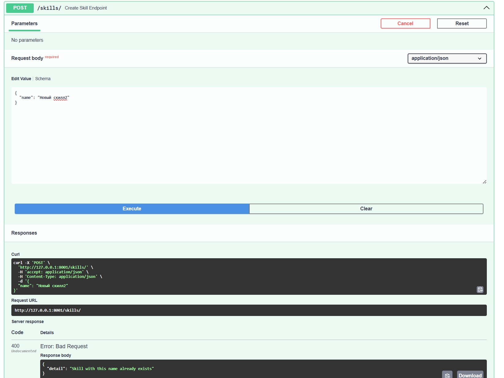

# Лабораторная работа №1. FastAPI, PostgreSQL и SQLAlchemy

## Цель работы

Разработать REST API сервис для поиска попутчиков и организации поездок с использованием FastAPI, PostgreSQL и SQLAlchemy.

# Travel Buddy API

Веб-сервис для поиска попутчиков и организации поездок.

Проект реализован с использованием FastAPI, PostgreSQL и SQLAlchemy.

Основные возможности:
- регистрация и авторизация пользователей
- создание поездок
- добавление маршрутов
- управление участниками поездок
- поиск поездок

## Главная страница API

---

# Описание системы

Разработан REST API сервис для организации поездок и поиска попутчиков.

Система позволяет пользователям взаимодействовать друг с другом через создание и управление поездками, а также обмен информацией о маршрутах и участниках.

## Основные возможности

Пользователь может:

- зарегистрироваться и авторизоваться в системе  
- создавать поездки с описанием и целью  
- получать список всех поездок или конкретную поездку по id  
- редактировать и удалять свои поездки  
- добавлять маршруты (destinations) к поездке  
- просматривать маршруты всех поездок  
- подавать заявки на участие в поездке  
- просматривать участников поездки  
- управлять статусом участников  

## Работа с данными

Система предоставляет полный доступ к данным через API:

- можно получать информацию обо всех сущностях (пользователи, поездки, маршруты, участники)  
- можно получать отдельные объекты по их идентификатору  
- можно добавлять новые данные в систему  
- можно изменять существующие данные  
- можно удалять данные  

Таким образом, реализован полный набор CRUD-операций для всех ключевых сущностей.

## Авторизация и безопасность

Доступ к защищённым эндпоинтам осуществляется с использованием JWT-токенов.

После успешной авторизации пользователь получает токен, который передаётся в заголовке:

    Authorization: Bearer <token>

Сервер определяет пользователя на основе токена и применяет ограничения доступа:

- только автор может изменять или удалять свою поездку  
- доступ к защищённым действиям возможен только при наличии валидного токена  

## Архитектура

Сервис построен по клиент-серверной архитектуре:

- Backend: FastAPI  
- База данных: PostgreSQL  
- ORM: SQLAlchemy  
- Миграции: Alembic  

API реализован в стиле REST и обеспечивает обмен данными в формате JSON.

---

# База данных

Используется PostgreSQL и ORM SQLAlchemy.

## Основные сущности:

### User
- id
- email
- name
- bio
- hashed_password

### Trip
- id
- title
- description
- owner_id

### Destination
- id
- city
- country
- trip_id

### Skill
- id
- name

### TripParticipant
- id
- user_id
- trip_id
- status
- message

# База данных

Используется PostgreSQL + SQLAlchemy ORM.

## Модель User

    class User(Base):
        __tablename__ = "users"

        id = Column(Integer, primary_key=True, index=True)
        email = Column(String, unique=True, nullable=False)
        name = Column(String)
        bio = Column(String)
        hashed_password = Column(String, nullable=False)

## Модель Trip

    class Trip(Base):
        __tablename__ = "trips"

        id = Column(Integer, primary_key=True, index=True)
        title = Column(String, nullable=False)
        description = Column(String)
        owner_id = Column(Integer, ForeignKey("users.id"))

## Ассоциативная таблица

    class TripParticipant(Base):
        __tablename__ = "trip_participants"

        id = Column(Integer, primary_key=True)
        user_id = Column(Integer, ForeignKey("users.id"))
        trip_id = Column(Integer, ForeignKey("trips.id"))
        status = Column(String)
        message = Column(String)

## Связи

- User → Trip (one-to-many)
- Trip → Destination (one-to-many)
- User ↔ Trip (many-to-many через TripParticipant)

---

# API

## Создание пользователя

POST /users/

Пример запроса:

    {
      "email": "user@example.com",
      "name": "Alex",
      "bio": "Traveler",
      "password": "12345678"
    }

Пример ответа:

    {
      "id": 1,
      "email": "user@example.com",
      "name": "Alex"
    }

## Демонстрация работы GET запроса

## Создание поездки

POST /trips/

    {
      "title": "Trip to Georgia",
      "description": "Looking for people"
    }

## Демонстрация работы POST запроса

## Поиск

GET /trips/search?country=Georgia

## Эндпоинты

### Users
- POST /users/
- GET /users/
- GET /users/{id}
- PUT /users/{id}
- DELETE /users/{id}

### Trips
- POST /trips/
- GET /trips/
- GET /trips/{id}
- PUT /trips/{id}
- DELETE /trips/{id}

### Destinations
- POST /destinations/trip/{trip_id}
- GET /destinations/

### Participants
- POST /trip-participants/trip/{trip_id}

---

# Авторизация

Используется JWT.

## Логика

1. пользователь вводит email и пароль  
2. сервер проверяет данные  
3. возвращает токен  
4. токен используется в заголовке Authorization  

## Код логина

    @router.post("/login")
    def login_endpoint(form_data: OAuth2PasswordRequestForm = Depends()):
        user = get_user_by_email(db, form_data.username)

        if not verify_password(form_data.password, user.hashed_password):
            raise HTTPException(status_code=401)

        token = create_access_token({"sub": str(user.id)})
        return {"access_token": token}

## Использование токена

Authorization заголовок:

    Authorization: Bearer <token>

## Получение текущего пользователя

    def get_current_user(token: str = Depends(oauth2_scheme)):
        payload = decode_access_token(token)

## Пример авторизации

## Если пользователь не авторизован - получаем ошибку

---

# Тестирование

Тестирование выполнялось через Swagger UI.

Проверены сценарии:

- создание пользователей
- авторизация
- создание поездки
- добавление маршрутов
- добавление участников
- поиск поездок

Также проверены ошибки:

- 400 (дубликаты)
- 401 (без авторизации)
- 403 (нет прав)
- 404 (не найдено)

## Пример ошибки при POST запросе

---

# Заключение

В рамках работы был разработан REST API сервис для поиска попутчиков.

Были изучены:
- FastAPI
- работа с PostgreSQL
- ORM SQLAlchemy
- Alembic миграции
- JWT авторизация

Реализована система с контролем доступа и связями между сущностями.