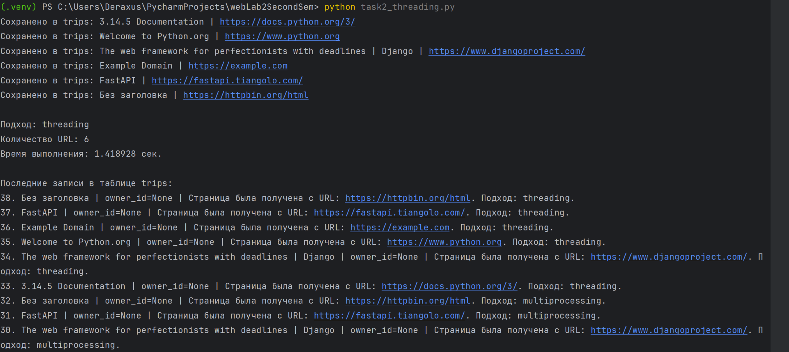
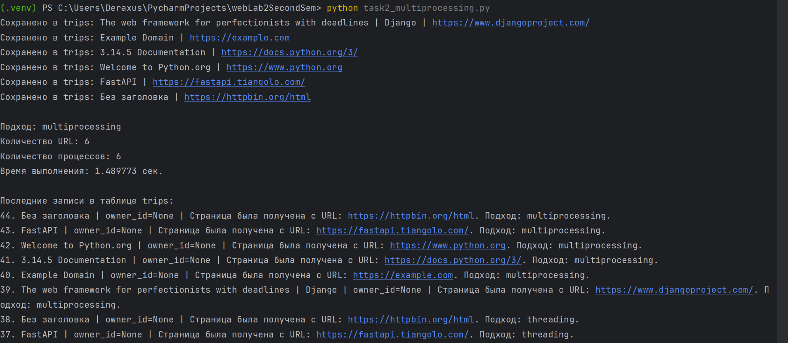
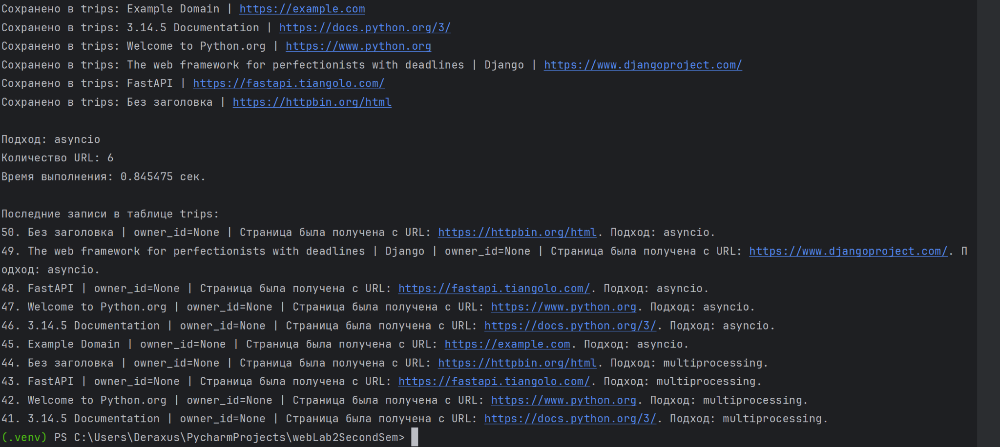
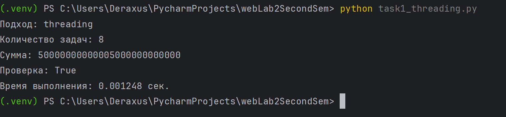
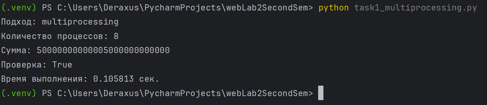
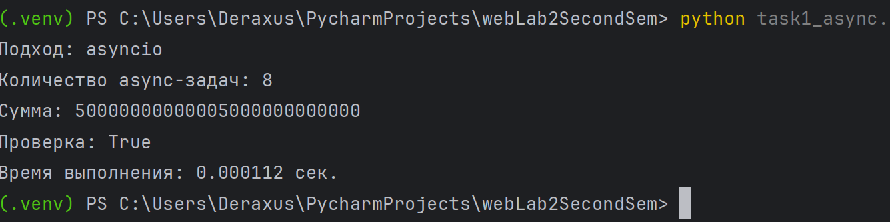
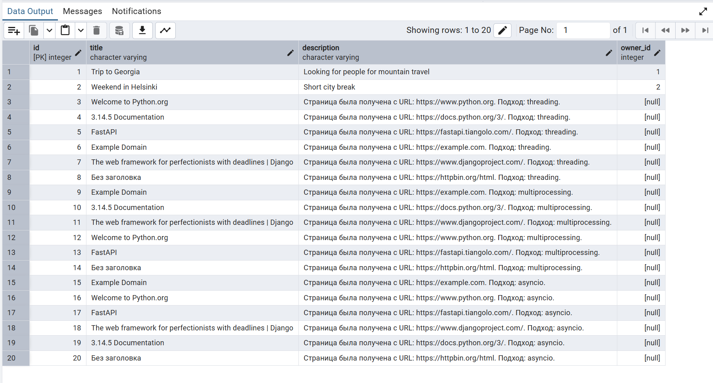

# Лабораторная работа №2. Потоки. Процессы. Асинхронность

## Цель работы

Изучить особенности `threading`, `multiprocessing` и `asyncio` в Python, а также сравнить эффективность разных подходов на вычислительных и сетевых задачах.

---

## Задача 1. Вычисление суммы чисел

В первой задаче требовалось реализовать три программы, которые считают сумму чисел от 1 до 10 000 000 000 000 с использованием трех подходов:

- `threading`;
- `multiprocessing`;
- `asyncio`.

Для вычисления суммы использовалась формула арифметической прогрессии:

```text
sum = (start + end) * count / 2
```

Такой вариант выбран потому, что прямой перебор чисел до 10 000 000 000 000 выполнялся бы слишком долго.

### Результаты измерений

| Программа | Время выполнения, сек |
|---|---:|
| task1_threading.py | 0.001248 |
| task1_multiprocessing.py | 0.105813 |
| task1_async.py | 0.000112 |

### Выполнение task1_threading.py



### Выполнение task1_multiprocessing.py



### Выполнение task1_async.py



---

## Задача 2. Параллельный парсинг веб-страниц

Во второй задаче требовалось реализовать параллельный парсинг нескольких веб-страниц с сохранением результата в базу данных.

Для хранения данных использовалась PostgreSQL-база из лабораторной работы №1. Данные сохранялись в таблицу `trips`.

Используемые данные:

- `title` — заголовок страницы;
- `description` — URL страницы и использованный подход;
- `owner_id` — `NULL`.

### Результаты измерений

| Программа | Время выполнения, сек |
|---|---:|
| task2_threading.py | 1.418928 |
| task2_multiprocessing.py | 1.489773 |
| task2_async.py | 0.845475 |

### Выполнение task2_threading.py



### Выполнение task2_multiprocessing.py



### Выполнение task2_async.py



---

## Записи в PostgreSQL

После выполнения программ данные появились в таблице `trips`.



---

## Анализ результатов

В первой задаче быстрее всего выполнился вариант с `asyncio`, а самым медленным оказался `multiprocessing`. Это связано с тем, что сумма считается через математическую формулу, поэтому сами вычисления занимают очень мало времени. В такой ситуации накладные расходы на создание процессов оказываются заметнее, чем польза от параллельности.

Во второй задаче быстрее всего выполнился вариант с `asyncio`. Это ожидаемо, потому что парсинг веб-страниц является I/O-bound задачей: программа большую часть времени ожидает ответы от сайтов и базы данных. `threading` тоже показал хороший результат, так как потоки подходят для задач ввода-вывода. `multiprocessing` оказался медленнее из-за дополнительных затрат на создание отдельных процессов.

---

## Вывод

В ходе лабораторной работы были реализованы три подхода к параллельному выполнению задач в Python:

- `threading`;
- `multiprocessing`;
- `asyncio`.

Было установлено, что:

- `multiprocessing` лучше подходит для тяжелых CPU-bound задач;
- `threading` хорошо подходит для задач ввода-вывода;
- `asyncio` наиболее эффективен для большого количества сетевых запросов.
