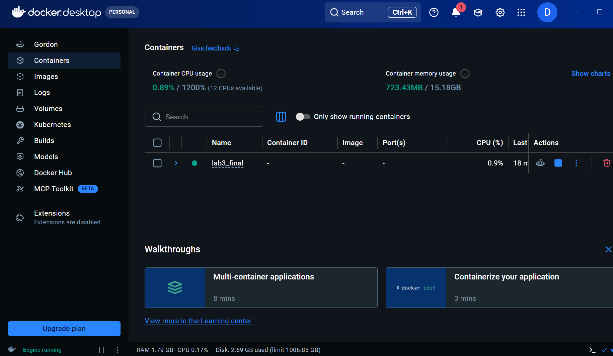
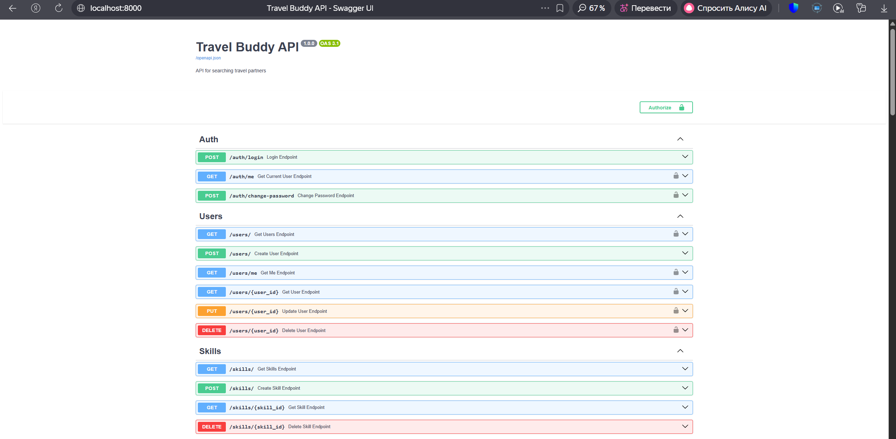
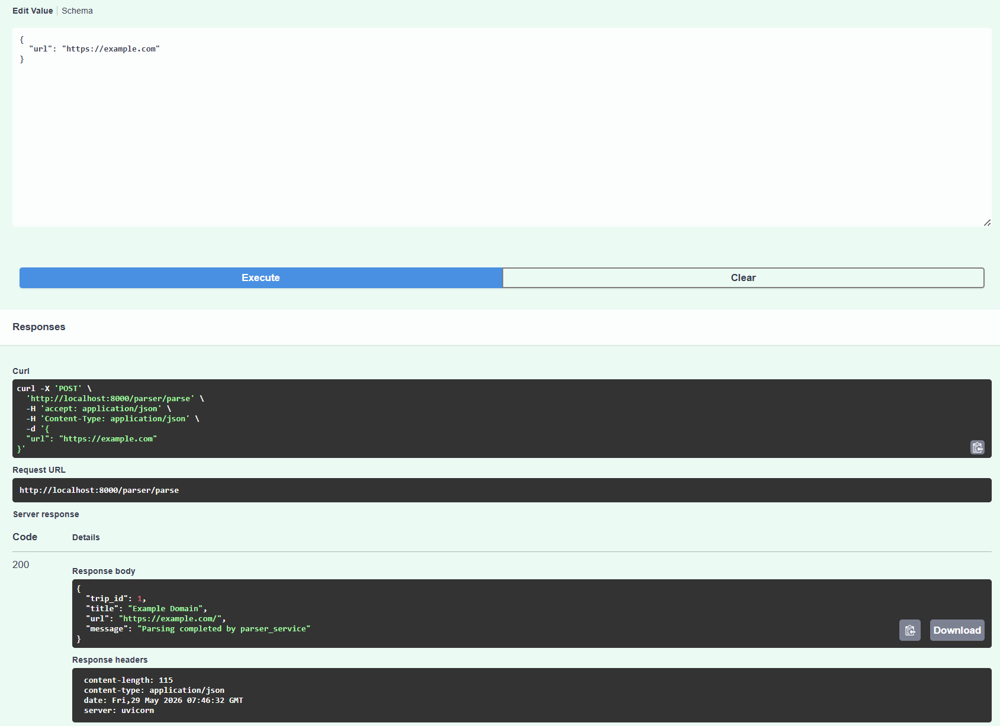
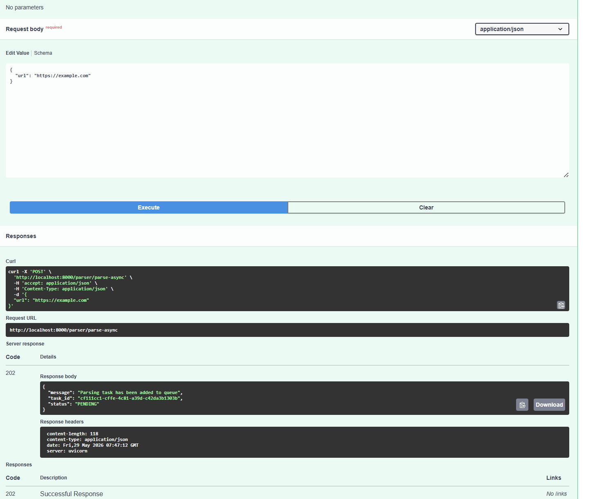
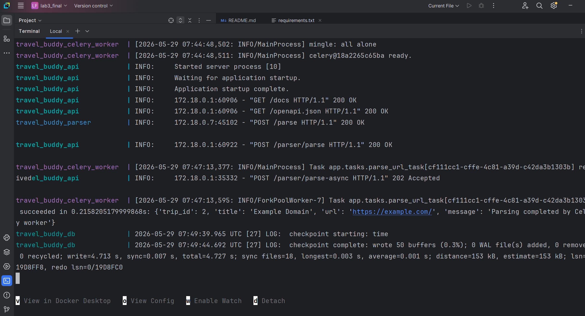
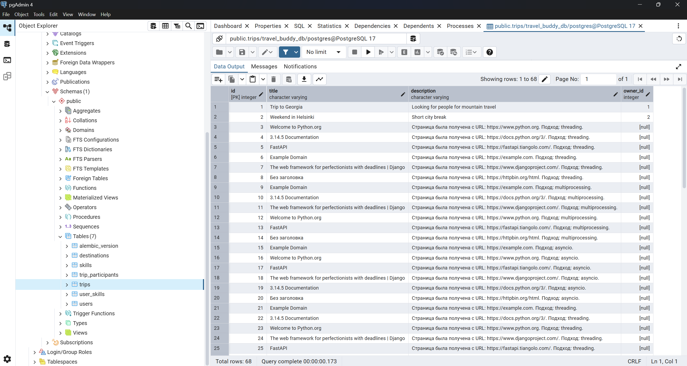

# Лабораторная работа №3. Docker. Celery. Redis

## Цель работы

Изучить контейнеризацию приложений с использованием Docker и Docker Compose, а также реализовать асинхронную обработку задач с помощью Celery и Redis.

---

# Описание работы

В качестве основы был использован FastAPI-проект из предыдущих лабораторных работ.

В рамках лабораторной работы были реализованы:

- контейнеризация FastAPI-приложения;
- контейнеризация PostgreSQL;
- отдельный parser service;
- взаимодействие сервисов по HTTP;
- Redis как брокер сообщений;
- Celery worker для фоновых задач;
- асинхронная постановка задач в очередь.

---

# Используемые технологии

- Python 3.13
- FastAPI
- PostgreSQL
- SQLAlchemy
- Docker
- Docker Compose
- Redis
- Celery
- Requests
- BeautifulSoup4

---

# Архитектура проекта

В проекте используются следующие контейнеры:

- `travel_buddy_api` — основной FastAPI API;
- `travel_buddy_parser` — сервис парсинга страниц;
- `travel_buddy_db` — PostgreSQL;
- `travel_buddy_redis` — Redis broker;
- `travel_buddy_celery_worker` — Celery worker;
- `travel_buddy_celery_beat` — сервис для периодических задач Celery.

---

# Docker Compose

Для запуска всей инфраструктуры использовался Docker Compose.

Команда запуска:

```bash
docker compose up --build
```

## Запущенные контейнеры



---

# Swagger документация

После запуска API документация доступна по адресу:

```text
http://localhost:8000/docs
```

## Swagger UI



---

# Parser Service

Был реализован отдельный сервис парсинга веб-страниц.

Сервис принимает URL, загружает HTML-страницу, извлекает заголовок страницы и сохраняет данные в PostgreSQL.

Эндпоинт:

```http
POST /parser/parse
```

---

# Синхронный парсинг

Пример запроса:

```json
{
  "url": "https://example.com"
}
```

## Результат выполнения



---

# Celery и Redis

Для асинхронной обработки задач был реализован Celery worker и Redis broker.

Redis используется как очередь сообщений.

Celery worker получает задачи из Redis и выполняет парсинг страниц в фоновом режиме.

---

# Асинхронный парсинг через очередь

Эндпоинт:

```http
POST /parser/parse-async
```

После отправки запроса задача помещается в очередь Redis и обрабатывается Celery worker.

## Результат постановки задачи



---

# Логи Celery Worker

Во время выполнения задачи Celery worker получает задачу из Redis и выполняет парсинг страницы.

## Выполнение задачи Celery



---

# PostgreSQL

После выполнения парсинга данные успешно сохраняются в таблицу `trips`.

## Таблица trips



---

# Анализ результатов

В ходе лабораторной работы была реализована микросервисная архитектура с использованием Docker Compose.

Контейнеризация позволила изолировать сервисы и запускать их независимо друг от друга.

Использование Redis и Celery позволило реализовать очередь задач и выполнять длительные операции в фоновом режиме без блокировки основного API.

Parser service был вынесен в отдельный контейнер, что соответствует принципам микросервисной архитектуры.

Docker Compose значительно упростил запуск всей инфраструктуры и взаимодействие сервисов между собой.

---

# Вывод

В ходе лабораторной работы были изучены:

- Docker;
- Docker Compose;
- Redis;
- Celery;
- контейнеризация FastAPI-приложений;
- асинхронная обработка задач;
- микросервисное взаимодействие.

Была реализована система с несколькими контейнерами, очередью задач и отдельным сервисом парсинга.

Все сервисы успешно взаимодействуют между собой, а данные сохраняются в PostgreSQL.
