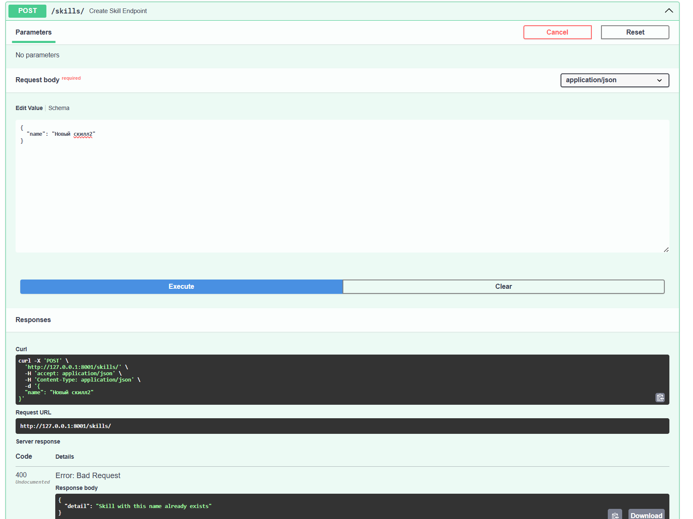

# Тестирование

Тестирование выполнялось через Swagger UI.

Проверены сценарии:

- создание пользователей
- авторизация
- создание поездки
- добавление маршрутов
- добавление участников
- поиск поездок

Также проверены ошибки:

- 400 (дубликаты)
- 401 (без авторизации)
- 403 (нет прав)
- 404 (не найдено)

## Пример ошибки при POST запросе
